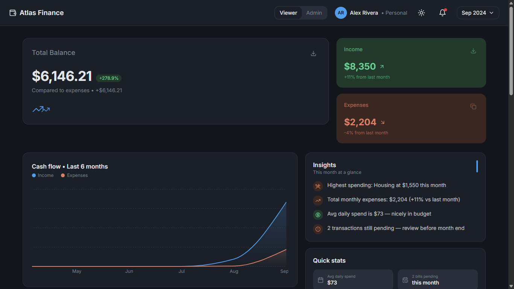
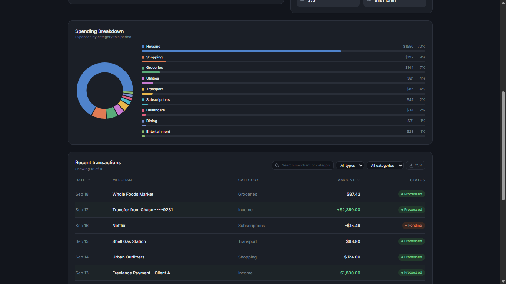

# Atlas Finance

A personal finance dashboard built for the Frontend Internship Assignment.




The goal was to build something clean and usable — not over-engineered. No backend, no auth, just a frontend that handles real interactions well.

**Live demo:** https://finance-dashboard-ui-gamma-lime.vercel.app

---

## What it does

- See your total balance, income, and expenses at a glance
- Browse and filter transactions by type, category, or search term
- Visualize spending by category (donut chart) and cash flow over 6 months (area chart)
- Switch between Viewer and Admin roles — admin can add, edit, and delete transactions
- Pick a specific month to scope all the data, or view everything at once
- Auto-generated insights: top spending category, average daily spend, pending transactions

---

## Stack

React 18, TypeScript, Vite, Tailwind CSS, shadcn/ui, Recharts, React Router

---

## Running locally

```bash
npm install
npm run dev
```

Opens at `http://localhost:8080`

---

## How state is managed

Everything lives in one custom hook — `useDashboardState.ts`. It holds the transaction list, role, filters, and selected month. All derived values (totals, chart data, insights, filtered list) are computed with `useMemo` so nothing recalculates unnecessarily.

I went with a custom hook instead of Context or Redux because the state only needs to live in one place (`Index.tsx`) and prop-drill one level down. Adding a Provider tree would've been overkill here.

Transactions are saved to `localStorage` so they persist across refreshes. To reset to the default data, clear the `atlas_transactions` key.

---

## Filtering model

There are two layers:

1. The month picker scopes what data is visible across the whole dashboard
2. Search, type filter, category filter, and sort apply on top of that

Switching months resets the table filters automatically — otherwise you'd end up with confusing empty states.

---

## Role-based UI

No backend or auth involved. The Viewer/Admin toggle in the header just controls what's rendered. Viewer sees a read-only table. Admin gets the Add button, inline row editing, and delete with a confirmation step.

---

## A few honest notes

- The "vs last month" percentage in the insights panel uses a mock delta (10%). With a real dataset or API it would compare actual monthly totals.
- The stat cards also use mock month-over-month percentages for the same reason.
- The cash flow chart pads with synthetic earlier months if there are fewer than 6 months of real data.

---

## Optional features included

- Dark mode (system preference + manual toggle, saved to `localStorage`)
- CSV export of the current filtered transaction view
- Advanced filtering with a reset button
- Hover transitions and micro-interactions throughout
